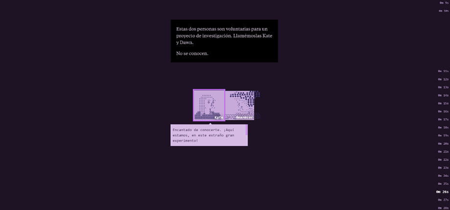
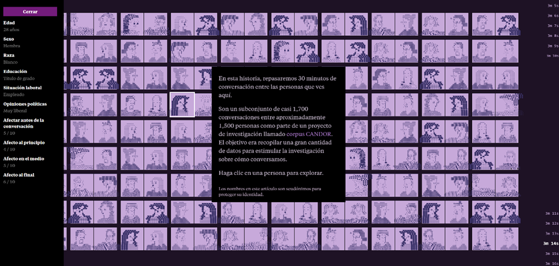
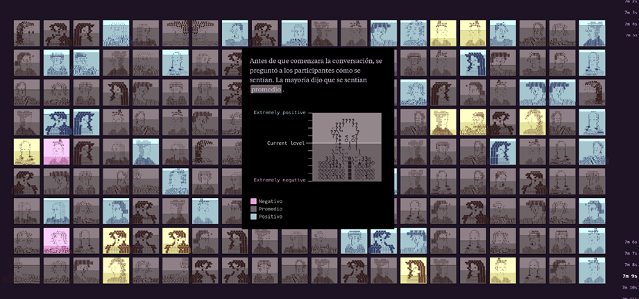
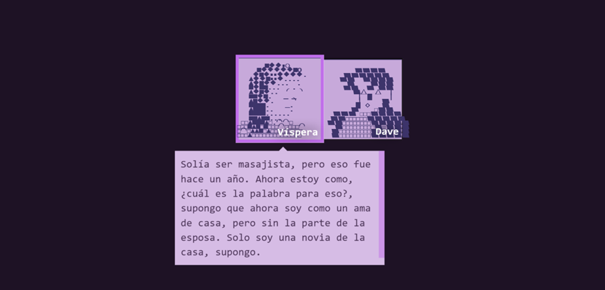
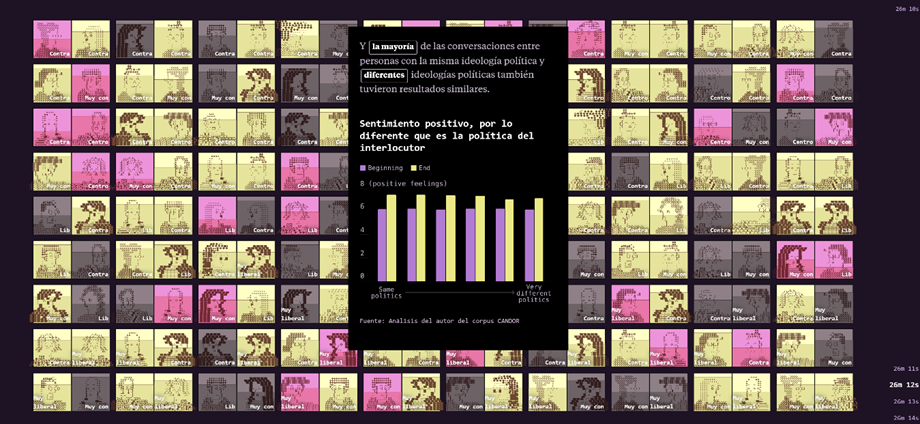

# Repositorio de tareas
## Tarea 01: "30 minutos con un extraño"
1. https://pudding.cool/2025/06/hello-stranger/

El reportaje “30 minutos con un extraño” aborda el tema de la desconfianza entre desconocidos. Se tomó una muestra de 1.500 personas y se les pagó por tener una conversación de 30 minutos con alguien a quien no conocían. En un comienzo los participantes se sentían incómodos y creían que la experiencia sería negativa. Pero analizando las conversaciones de las parejas a medida que fluía la charla y a través de una encuesta sobre cómo se iban sintiendo, se demostró que las personas, al finalizar el experimento y la conversación, afirmaban sentirse mucho mejor que al comienzo. Generaban incluso un pequeño lazo con quien habían conectado y deseaban volver a verse. 

Desde un comienzo el reportaje me pareció muy llamativo. Utiliza colores fuertes y es muy creativo a la hora de contarnos la historia y entregarnos los datos. Me gustó que partiera con el ejemplo de dos personas que pudieron conversar y se mostrará también el contenido que lo que hablaban. A medida que se bajaba en el artículo, se seguía mostrando la charla y en un costados los minutos que llevaba la llamada.  

El reportaje utilizaba recursos muy llamativos e interactivos, como las ilustraciones de las personas, por ejemplo. Se podía apretar a cualquier persona y se desplegaba la información sobre ella; sus características personales y sociales, y también sus sensaciones durante la conversación. 

Cuando se quería mostrar algún dato sobre cómo se iban sintiendo las personas, o mostrar y agruparlos según edad y género, los cuadros de las personas se iban tiñendo de un color. En la imagen adjunta, por ejemplo, se utiliza el gris para representar a las personas que se sentían promedio antes de iniciar la conversación. Creo que ese es un recurso muy efectivo, ya que inmediatamente al ver las imágenes y los colores, podemos concluir rápidamente como 
se sentía la gente. 
Luego de mostrarnos ya un rato de conversación y algunos datos ilustrados, se da un contexto general del tema y la historia. Se muestran cifras con un gráfico más sencillo que demuestran que la desconfianza de los estadounidenses hacia extraños ha aumentado. Creo que eso funciona muy bien. Se muestran primero recursos más llamativos sin tanta información para que nos interesemos y queramos seguir bajando, y luego de un rato se incluye información que nos permite entender mejor y más ampliamente de que se trata lo que estamos viendo.

A medida que se iban entregando datos e información contextual, se mostraba la como iba fluyendo la conversación entre una de las parejas. En mi opinión eso hace mucho más interesante y capta con la atención de la audiencia. Personalmente leí cada uno de los diálogos que se iban mostrando, porque ejemplificaban muy bien lo que se iba mostrando en datos. Cuando se hablaba, por ejemplo, de que las personas a mitad de la conversación se sentían mejor que al inicio y mucho más seguras, la conversación de la pareja también lo demostraba. Abordaban temas más personas e íntimos. 

Me pareció interesante también que dentro de la representación de como se iban sintiendo las personas a través de los colores, se incluyeran gráficos más simples incluyendo otro tipo de información adicional. 

Finalmente, para acabar el reportaje, el autor incluyó una anécdota personal que lo llevo a pensar y plantearse el tema de la desconfianza en las personas. Ese aspecto más personal que nos puede hacer empatizar, creo que fue una muy buena manera de conectar con los que leíamos el artículo. Pienso esa fue la idea desde un inicio, mostrándonos de ejemplo el dialogo que había tenido una pareja en llamada. Que al leerlos nos sintiéramos más cercanos a la historia. Sin duda creo que fue el recurso utilizado que más me gustó. Siento que los colores, los gráficos y la forma de entregar los datos y contar la historia, fue muy buena. Creo que se podía entender muy bien la historia solo con las ilustraciones y mostrando siempre la información de contexto cada tanto. Todo estuvo muy bien pensado, el titulo es “30 minutos con un extraño” y al final muestran toda la conversación y el reportaje entero con la marca de los minutos a un costado. 
